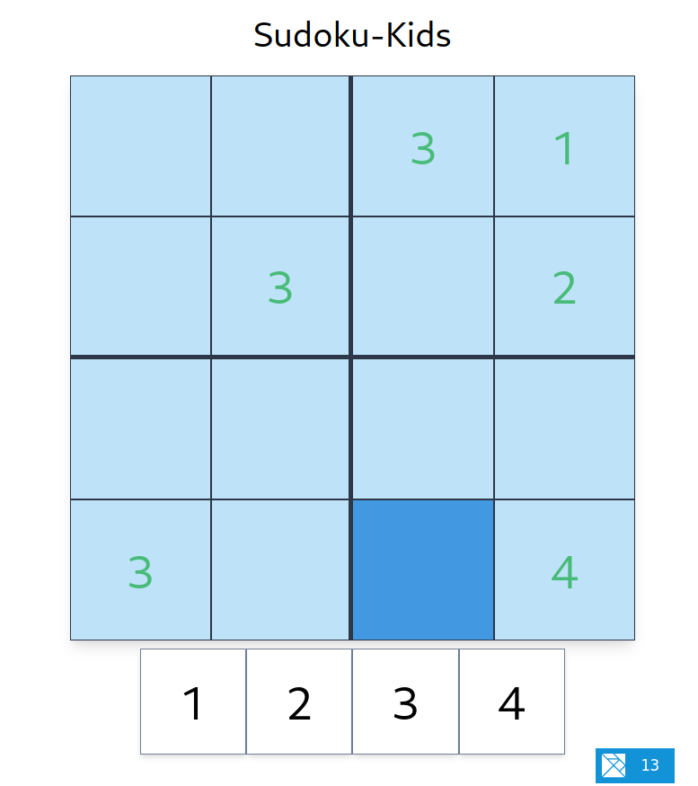

# Sudoku-Kids

A small game of sudoku that kids (my own) are picking up surprisingly fast.

For anyone who's never played sudoku here are the rules:
There are only numbers 1-4.
1. Any row can only contain each number once.
2. Any column can only contain each number once.
3. Any of the four large boxes(divided by the heavier seperators) can only
contain each number once.

Your job is to fill out the empty cells until all numbers are filled in.
Good luck :+1:

## Technology

Written with Elm, Parcel and TailwindCSS aka the [PET-Stack](https://deedop.de/blog/the-pet-stack-1).
